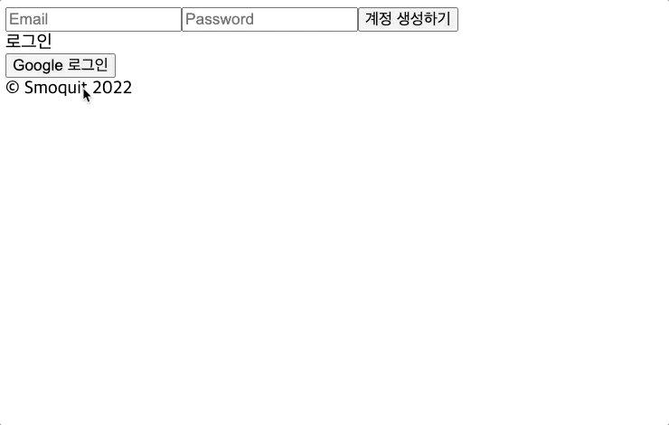
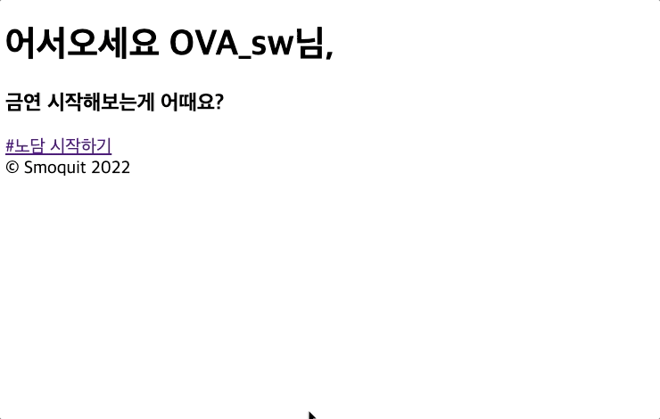
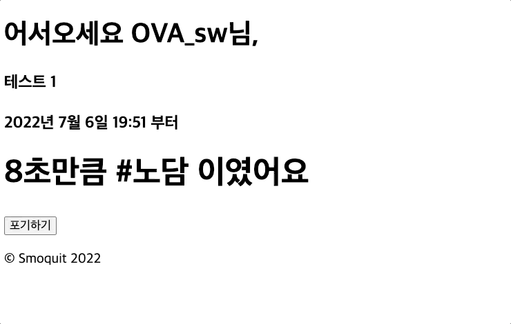

# #노담이면\_좋겠어 Smoquit

매 번 금연을 도전은 하는데 동기부여가 없어 실패하는 사람들을 위한 금연 카운터입니다.

## 구현 목표

- 금연 시작 및 금연 포기 로직 구현
- 지금까지의 도전 내용 조회
- 지금까지 몇개피의 담배를 피우지 않았고, 돈은 얼마나 아꼈는지 보여주기
- 금연 Leaderboard
- 내 친구의 금연 상황 보기 (경쟁적 금연 유도)
- 친구와 금연 내기 기능 구현

## Stack 및 얻고자 하는 것

- `React.js` `Redux` `Firebase`
- NoSQL 자유자재로 다루기
- React.js로 예쁜 UI 구현하기
- 실제 서비스하는 경험 얻기

---

## 구현된 기능

### 로그인

### 금연 시작

### 금연 포기

