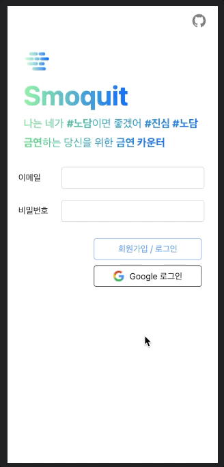
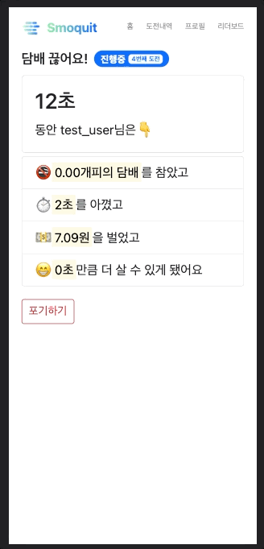
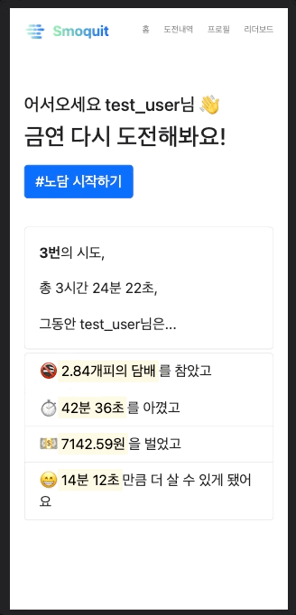
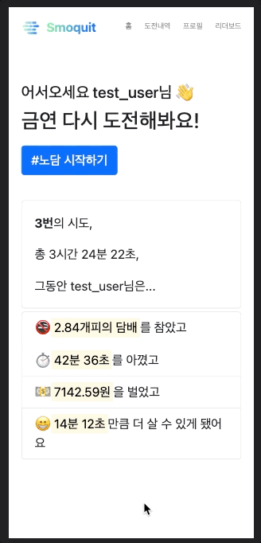
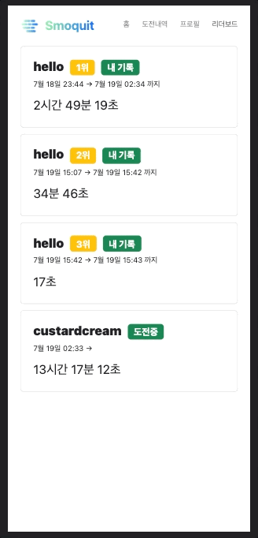

# #노담이면\_좋겠어 Smoquit

     

매 번 금연을 도전은 하는데 동기부여가 없어 실패하는 사람들을 위한 **금연 카운터**입니다.

[서비스 링크 🔗](https://custardcream98.github.io/smoquit/)

## 구현 목표

- 금연 시작 및 금연 포기 로직 구현
- 지금까지의 도전 내용 조회
- 지금까지 몇개피의 담배를 피우지 않았고, 돈은 얼마나 아꼈는지 보여주기
- 금연 Leaderboard
- 내 친구의 금연 상황 보기 (경쟁적 금연 유도)
- 친구와 금연 내기 기능 구현

## Stack 및 얻고자 하는 것

- `React.js` `Redux` `Redux-Tunk` `Firebase`
- NoSQL 자유자재로 다루기
- React.js로 예쁜 UI 구현하기
- 실제 서비스하는 경험 얻기

---

## 구현된 기능

### 로그인

### 금연 시작

### 금연 포기

---

## NoSQL Firestore DB Structure

`💼 Collection` `📙 Doc` `📄 Field`

- 💼 **campaigns_by_user**

  - 📙 **uid**: 유저별로 발급되는 uid
    - 💼 **campaigns**
      - 📙 **startsAt**: 각 캠페인(금연)의 시작 시각을 id로
        - 📄 **displayName**: 닉네임 (리더보드용)
          > firebase에서는 uid를 이용해 닉네임을 가져올 수 없어 이렇게 저장합니다.
        - 📄 **name**: 캠페인 이름(간단한 메모)
        - 📄 **startsAt**: 캠페인 시작 시각(int, Timestamp in millisecounds)
        - 📄 **endsAt**: 캠페인 종료 시각, 각 캠페인 포기시에 set(int, Timestamp in millisecounds)
        - 📄 **duration**: 캠페인 지속 시간, 각 캠페인 포기시에 set(int, Timestamp in millisecounds)

- 💼 **profile**: user에 추가로 저장해야 하는 정보
  - 📙 **uid**
    - 📄 **sigPerDay**: 하루에 몇개피 펴왔는지에 대한 정보, 메인 화면에서 필요한 정보 계산에 사용

---

# What I've Learned

천천히 정리할 예정입니다

## Redux-Tunk

Redux 미들웨어로, Redux Store의 dispatch, getState 메소드와 상호작용이 필요한 로직을 구현할 수 있게 도와줍니다. Redux 공식 문서에서 권장하는 방법처럼 Redux Toolkit을 사용한다면 기본적으로 포함되는 미들웨어입니다.

Redux에서는 원래 action을 dispatch해 간단한 동기(synchronous)적인 연산만 가능합니다. API fetch과 같이 비동기 연산으로 Store를 유지할 필요가 있다면 Redux Tunk같은 미들웨어의 도움을 받아야 합니다.

## GH Pages로 Router 사용하기

React.js는 SPA를 만들 수 있게 도와주는 tool입니다. 전통적인 방식이라면 클라이언트에서 요청한 경로에 맞는 html을 파싱해 보내주는것이 Web Server가 하는 일이지만, React를 사용하면 클라이언트의 url을 보고 html에서 새로 렌더링해야 되는 부분만 스크립트로 생성해 동적인 웹사이트를 만들 수 있게 해주는겁니다. 이 때 브라우저에서 제공하는 History API를 사용해 URL 또한 바뀌게 됩니다.

쉽게 말해, 각 html을 미리 만들어 보여주는 과거의 Multi Page Application과 다르게 SPA에서는 html은 새로 안받고 요청에 따라 필요한 부분을 바로바로 만들어 보여주는 방식입니다.

이렇게 하면 '새로고침 없는' 웹사이트를 만들 수 있어 사용자 입장에서 아주 만족스러운 웹 경험을 할 수 있습니다. 다른 페이지로 이동할 때 화면이 깜빡거리지 않고 부드럽게 딱딱 새로 렌더링되니까요.

그런데, SPA는 앞서 말했듯 Url Route를 낚아채줘야 합니다. 그러려면 React 코드와 웹서버가 쿵짝이 맞아야 하는데, 우리가 로직을 바꿀 수 없는 웹서버인 gh pages로 React App을 배포하면 React가 낚아채 렌더링해도 gh pages의 웹서버가 '그런 Url에 해당하는 html이 없는데요?' 하고 404을 띄워버립니다.

### HashRouter

이를 해결할 가장 쉬운 방법은 `HashRouter`를 이용하는 겁니다. `HashRouter`는 baseurl 끝에 '/#/'를 추가합니다.

예를 들어 `example.com/#/react/awesome`이라는 url이 있다면, 서버에서는 `#/react/awesome`이라는 path를 찾아가야 하는데, #덕분에 해쉬값으로 취급돼(는건지 실제 해쉬값인지는 공부가 필요) server side에서 접근하지 못하게 됩니다.(이를 Fragment라고 합니다.) client side에서 React Router가 `window.location.hash`를 파싱해주므로 React Router가 핸들링하게 되고, 이로써 SPA가 구동되는 방식입니다.

그러나, `HashRouter`를 이용하면 SEO에 치명적이게 됩니다. URL에 해시태그(#)가 들어가는것도 별로 안이쁘고요.

### 404 Redirect Trick

그래서 똑띠기들이 재밌는 해결책을 내놨습니다. `404.html`을 만들어서, 해당 페이지가 실행될 때 홈('/')으로 접근할 경로의 쿼리 스트링과 함께 바로 리다이렉션을 시켜버리고, 홈에서 쿼리 스트링을 파싱해 본래의 경로로 되돌린 뒤 현재 경로로 대체하는겁니다.

이를 위해 아래 Repository를 참고해 `404.html`을 추가하고, `index.html`에 script를 추가했습니다. 이 레포에 있는 코드는 정말 감사하게도 Google Bot이 스크립트를 실행하는 과정까지 고려해 짜주셨습니다. SEO도 어느정도 대응이 가능하다고 하네요.

[참고한 Repository](https://github.com/rafgraph/spa-github-pages)

[위 Repo의 한국어 번역본](https://sujinlee.me/spa-github-pages-ko/)

### 이 과정을 통해 부수적으로 배운 점 - SSR

SPA의 가장 큰 단점은 Client Side Rendering 방식으로 구현할 시 첫 페이지 로딩이 오래 걸린다는 것입니다. 한번의 로딩으로 모든 페이지에 대한 스크립트를 불러와야 하니, 웹사이트 크기가 커질수록 첫 로딩의 부담이 가중됩니다.

이를 해결할 수 있는 방법은 여러가지가 있고, 그 중의 하나가 Server Side Rendering으로, 말 그대로 웹서버측에서 렌더링해 보내주는 방식입니다.

이 외에도 Static Site Generation, SSR과 SSG를 섞은 하이브리드 방식 등 제공하고자 하는 서비스의 크기 등에 따라 여러 방법으로 웹서버를 만들 수 있습니다.
